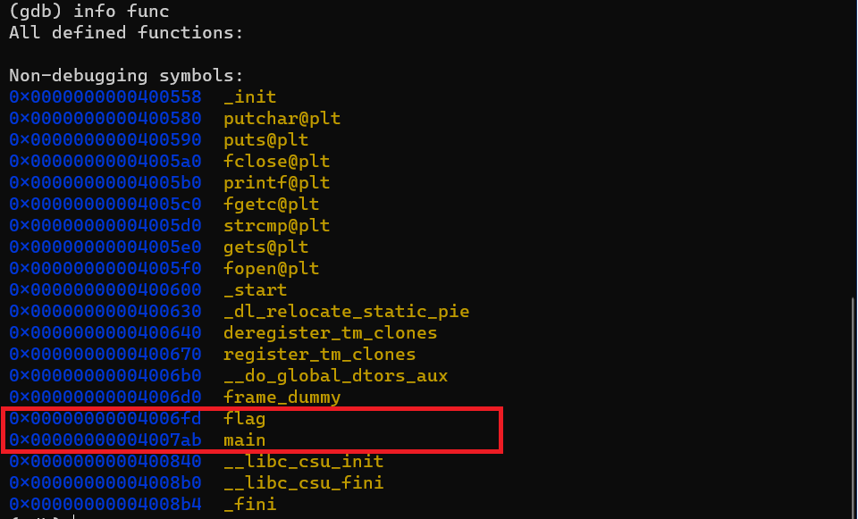
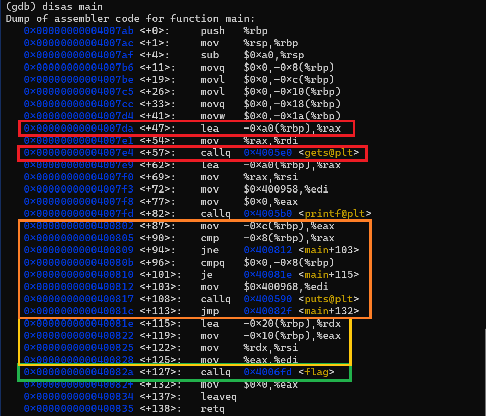
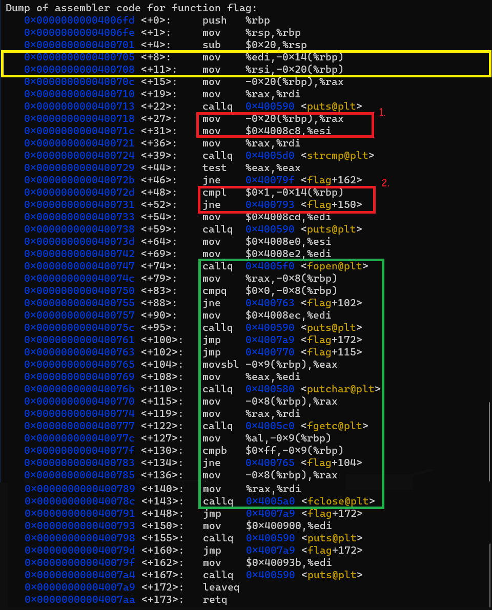

### __Question__ : 
    We people at Zense are planning to screen the series Mr Robot. We want it to be screened today itself. We are at blame. We didn't get the permission from Prof. Chetan Parikh in time. Can you help us screen Mr.Robot it today itself? But how do we get permission for opening the room? Getting the key for the room isn't enough this time as guards are always around Acad. block for checks :/    

    Connect to the challenge using nc chal.zense.co.in 6702

> Recomended : You fully understand the sac_Room question.

Let's start with examining what the function using gdb.
We first look what functions are available.



The function *flag* seems the place we want to get to isn't it? Now we see if it's accessible from main ... 



* _Green Box_ This is great! this we don't have a jump condition just above.
* _Orange Box_ Lets study the orange box to see if any unwanted jump happens.
    *   _jmp_ at _<113>_ should not occur because it is an unconditional jump to the end of the function.
    *   _jne 0x400812 <main+103>_ the values being compared are equal(both are 0) thus this woudn't cause any problem.
    *   _je 0x40081e <main+115>_ the values being compared and jump happens here. But this is a desired jump as we get past the unconditional jump.

>All in all with given code we actually are calling the flag function! Then what's the catch?

Let's get to the terminal and see what are we actually getting
```
samaverse@SamaVerse:/mnt/c/Users/samas/Downloads$ ./movie_screening
Karthik Sama
Hello Karthik Sama

Wait where are the keys!? :/
```

The string _Wait where are the keys!? :/_ is definitely not part of main we already examined it so now let's get to flag function to see what's happening inside.

We now try understanding the main function, and see if it helps.


* _Yellow Box_ Doesn't this segment look familiar? The registers _%edi_ and _%rsi_ were loaded just before the function call in main!. This means that we are sending parameters to the function flag. The locations _-0x14(%rbp)_ and _-0x20(%rbp)_ now hold these parameters
* _Red Box_ These are the places where the parameters passed are being used.
    1. The parameter at _-0x20(%rbp)_ is being compared with "Keys" at memory location 0x4008c8. Can be seen by:
        ```
        (gdb) x/s 0x4008c8
        0x4008c8:       "Keys"
        ```
    2. The parameter at _-0x14(%rbp)_ is being compared with 0x1.

    Both these being satisfied will allow us enter the _Green Box_ which will retrieve flag for us.

>Now we get an what to be put in parameters so switch back to the main code.

## Exploit:
Look at the instructions in _Red Box_ in the main function.
Thus are sting starts at _-0xa0(%rbp)_ and data we need to manipulate resides at locations _-0x20(%rbp)_ -> corresponds to the string parameter and _-0x10(%rbp)_ -> correspinds to the integer parameter.
- So at _-0x20(%rbp)_ we would put __'Keys\0'__ which is _0xa0-0x20 = 0x80(128)_ bytes away from our head.
- And at _-0x10(%rbp)_ we would put __'\x01\x00\x00\x00'__ integer 1 in LSB format which is _0xa0-0x10 = 0x90(144)_ bytes away from our head.

## Final Result:
    128*(some character) + 'Keys\0' + 11*(some character) + '\x01\x00\x00\x00'