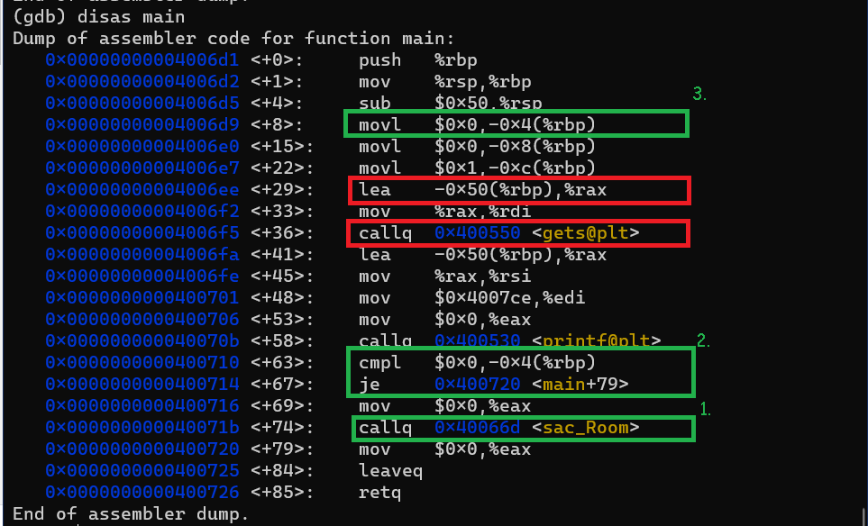

### __Question__ : 
    Well.. fun awaits in SAC room. But we can't find the security guard of Ramanujan. Though we have permission to enter, we can't wait till the guard turns up. Can you help us sneak into the SAC room cheating the guard?

    Connect to the challenge using nc chal.zense.co.in 6701

Let's start with examining what the function using gdb.
We first look what functions are available.

The functions *sac_Room* seems the place we want to get to isn't it? Let's confirm this

We see file operations here which confirms our assumption that if we get here something will read from an external file which potenially is the flag.

>But how do we get to this function?

We now try understanding the main function, and see if it helps.

1. This is great! the sac_Room function is indeed being called.
2. But there is catch what if this jmp statement skips over it? What does thi jump statement do? We can understand that it jumps past to <<Main+79>> instruction if the instruction above __cmpl $0x0,-0x4(%rbp)__ is satisfied.
3. But! we observe that __-0x4(%rbp)__ is initialized to 0!

## Exploit:
_Look at the instructions in red in the image just above_
- So our target is to write to the memory location __-0x4(%rbp)__ 
- Our input is taken in by __gets__ function at __-0x50(%rbp)__ . To get to the location of aur target we are _0x50-0x4 = 0x4C (i.e. 76)_ bytes away. Thus if we filled the stack with 76 bytes of data and then some excessive data then the memory at our target will be non-zero.

## Final Result:
    Exploit should be 76*(some character) + i*(some_character) where i in {1,2,3,4}