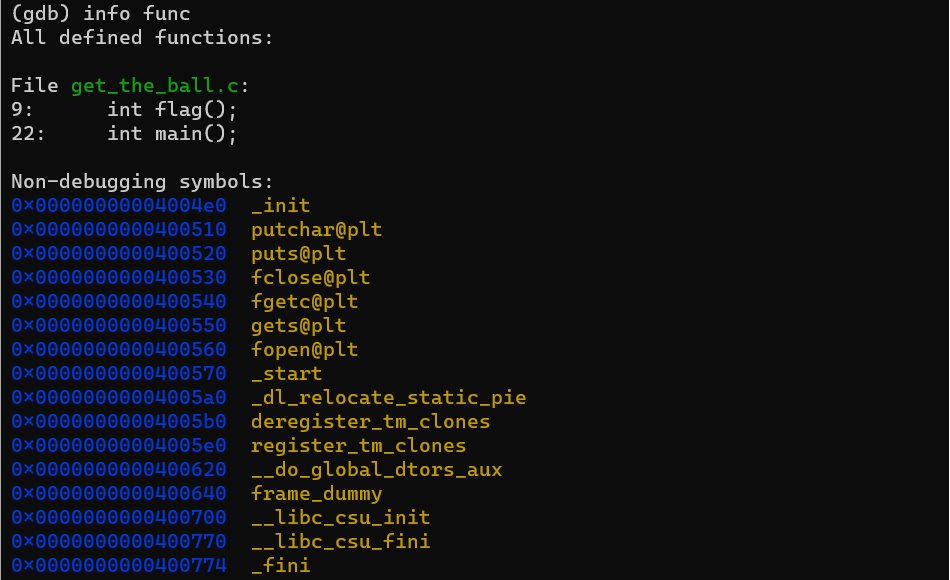
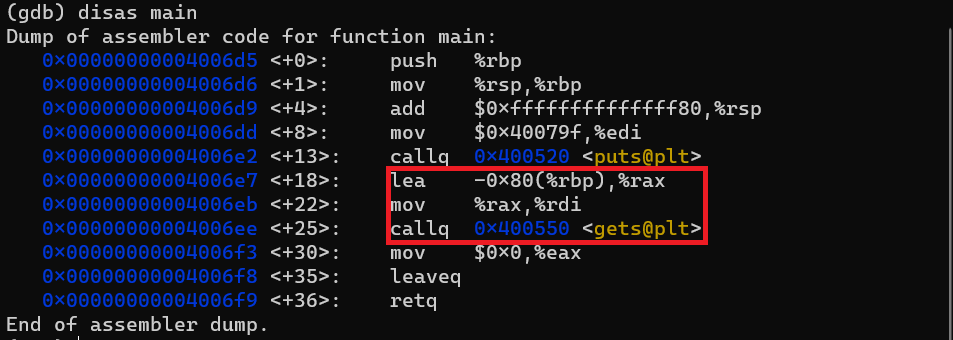
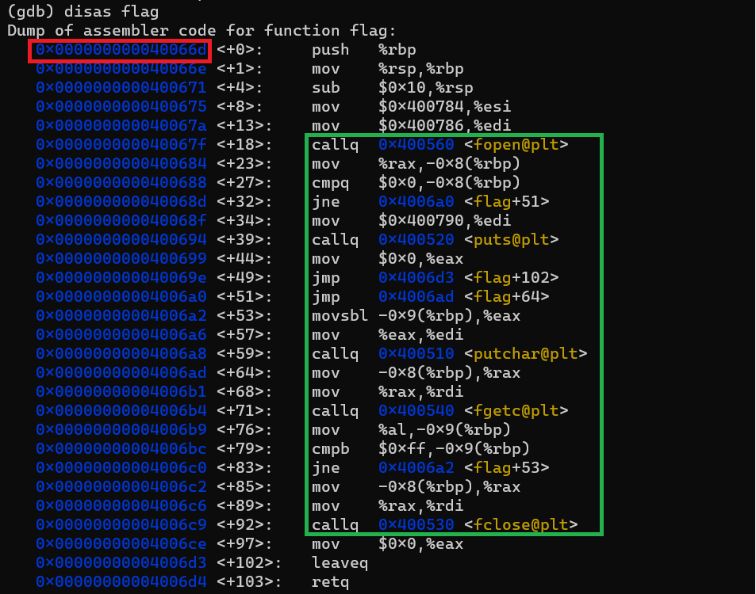
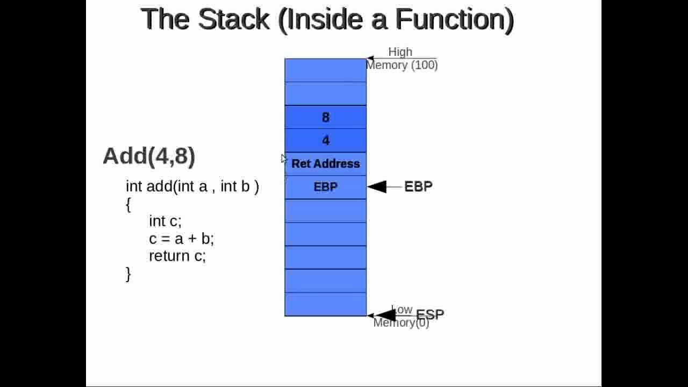

### __Question__ : 
    We are playing cricket in our Mini cricket ground. This is the last ball we have got for now. But..... unluckily the ball flies away to the top of Ramanujan. The security is fed up and won't get the ball for us anymore. Can you help us get the ball from the roof? We don't want to stop playing yet.

    Connect to the challenge using nc chal.zense.co.in 6703

Let's start with examining what the function using gdb.
We first look what functions are available.

The function *flag* seems the place we want to get to isn't it? Now we see if it's accessible from main ... 

>Well well this time we don't see the call to flag function! What next?

>Even the flag function seems to just get the flag get printed!. So now it's on us to call this function somehow.

## Some Theory:

_source : https://www.youtube.com/watch?v=vcfQVwtoyHY_

The ebp is a base pointer. It stores an address and using this address the local variables are refferenced. Just above the ebp pointer lies the return address. This the address the function will return flow of execution to. 

Getting some idea now? Yeah we need to modify this return address and change flow of execution to the flag function. And that address is the address in _Red Box_ in the picture of flag function.

## Exploit:
As we see the picture of main function the _Red Box_ , our input starts to get stored at _-0x80(%rbp)_ We will have fill the space all the way till rbp. Then rbp itself and then the return address.

## Final Result:
    128*(some character) + 8*(some character) + '\x6d\x06\x40\x00\x00\x00\x00\x00'
