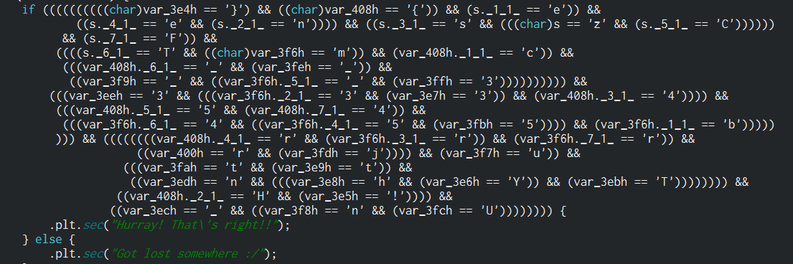
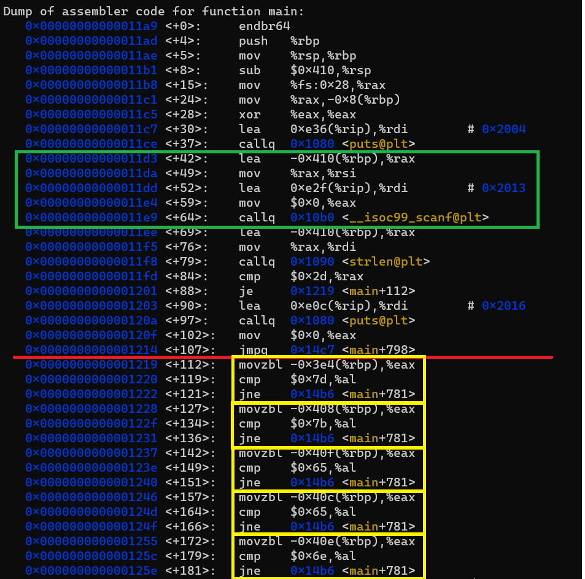

## Solution
One would generally start off with decompiling the code. Let's see what we have. I have decompiled the code using Cutter.



Woah there are to many if conditions right. But they are character comparisions. So you get an idea some characters are being compared.
But one thing is clear _strlen(&s) = 0x2d(45)_ i.e. length of the input string must be 45! Some break through.

Even if we gathered all the characters together, they never are in order right?

>Hint : There is only one variable in the source code.

Well if you think in lines of the _Hint_ things get a bit clearer. There is only variable and actually the executable takes an input! And also it processes our input! Which means the place where it stores is the only variable and all these comparisions are compared w.r.t. our input.

>Note : Not always decompiled code is the exact original code it only depicts the flow of execution that it analyses from binary file.

So we get back to our standard tool gdb! Let's look into the main function.


_This is just a part of disassembly_

### Few observations

* The disassembly above the _Red line_ is for checking the length of the string.
* Our input is loaded at memory location _-0x410(%rbp)_ as highlated in the _Green Box_
* Then there is quite repeating code in the _Yellow boxes_ . Yes these are the if comparisions. The _movzbl_ instruction gives us how far the char is from head and the _cmp_ instruction is basically the **ascii** value of the character.

From these observations a small script can be written :

```
>>> def place_char(s,addr,val):
...  head = 0x410
...  s[head-addr] = chr(val)
...  print(s)
...
```

```
>>> place_char(l,0x3e4,0x7d)
[' ', ' ', ' ', ' ', ' ', ' ', ' ', ' ', ' ', ' ', ' ', ' ', ' ', ' ', ' ', ' ', ' ', ' ', ' ', ' ', ' ', ' ', ' ', ' ', ' ', ' ', ' ', ' ', ' ', ' ', ' ', ' ', ' ', ' ', ' ', ' ', ' ', ' ', ' ', ' ', ' ', ' ', ' ', ' ', '}']
>>> place_char(l,0x408,0x7b)
[' ', ' ', ' ', ' ', ' ', ' ', ' ', ' ', '{', ' ', ' ', ' ', ' ', ' ', ' ', ' ', ' ', ' ', ' ', ' ', ' ', ' ', ' ', ' ', ' ', ' ', ' ', ' ', ' ', ' ', ' ', ' ', ' ', ' ', ' ', ' ', ' ', ' ', ' ', ' ', ' ', ' ', ' ', ' ', '}']
>>> place_char(l,0x40f,0x65)
[' ', 'e', ' ', ' ', ' ', ' ', ' ', ' ', '{', ' ', ' ', ' ', ' ', ' ', ' ', ' ', ' ', ' ', ' ', ' ', ' ', ' ', ' ', ' ', ' ', ' ', ' ', ' ', ' ', ' ', ' ', ' ', ' ', ' ', ' ', ' ', ' ', ' ', ' ', ' ', ' ', ' ', ' ', ' ', '}']
```

This combined with a bit manual labour will give you the flag!